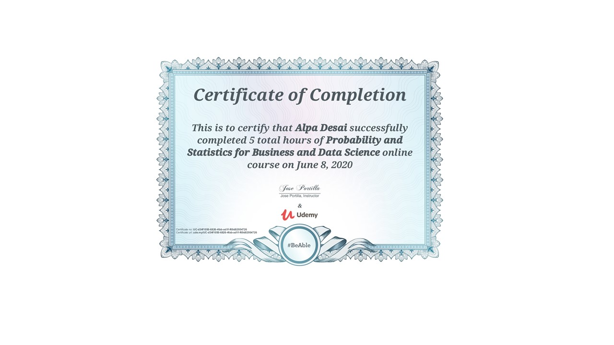

# Probability 

The project provides an introduction to Probability Stochastic Processes

Confidential information is not displayed.

All images are either custom by Alpa D Desai or a reference name is provided.

## Probability Theory 

## Stochastic Processes

## Probability and statistics

## Probability and statistics

## Probability and statistics

## Probability

Additional details reference: https://github.com/alpaddesai/DesignEngineering
